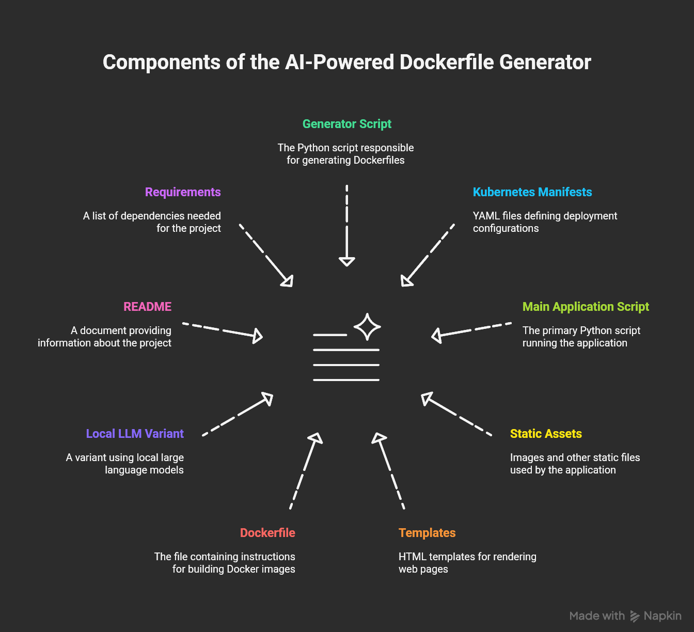

🐳 Dockerfile Generator App

The Dockerfile Generator App is a hands-on project showcasing how Large Language Models (LLMs) can accelerate DevOps workflows. This app automatically generates optimized Dockerfiles from your application code using both local LLMs and Azure AI Foundry’s OpenAI service.

It’s designed for DevOps engineers, cloud architects, and platform teams exploring how AI + DevOps can transform containerized deployments.

🚀 Features

🔹 LLM-powered Dockerfile generation – generate best-practice Dockerfiles from your codebase.

🔹 Dual-mode inference:

Either --> Local (Ollama + Mistral model) – fast, secure, offline usage --> For Dev environment.

Or --> Azure AI Foundry (OpenAI o4-mini) – scalable, enterprise-ready inference with large context windows.

🔹 Suggests multi-stage builds, security hardening, and optimized dependencies.

🔹 Built with FastAPI for speed, simplicity, and RESTful API support.

🛠️ Tech Stack

Backend Framework: FastAPI

Programming Language: Python 3.10+

Local AI Runtime: Ollama
 + Mistral model

Cloud AI Runtime: Azure AI Foundry
 (OpenAI Service o4-mini Model)

Containerization: Docker

Infra/Orchestration: Kubernetes-ready (optional)

Other Tools: GitHub Actions (for CI/CD), VS Code

📂 Project Structure

⚙️ Setup & Installation
1️⃣ Clone the repo
git clone https://github.com/<your-username>/dockerfile-generator-app.git
cd dockerfile-generator-app

2️⃣ Install dependencies
pip install -r requirements.txt

3️⃣ Configure environment variables

Create a .env file in the root directory:

# Local LLM (Ollama)
OLLAMA_MODEL=o4-mini

# Azure AI Foundry (OpenAI)
AZURE_OPENAI_KEY=your-azure-openai-key
AZURE_OPENAI_ENDPOINT=your-endpoint-url
AZURE_OPENAI_DEPLOYMENT=o4-mini

4️⃣ Run the app locally
uvicorn app.main:app --reload

App will be available at:
👉 http://127.0.0.1:8000/ (Swagger API docs)

🐳 Run with Docker

Build and run the app in a container:

docker build -t dockerfile-generator .
docker run -p 8000:8000 dockerfile-generator

☁️ Deploy with Azure AI Foundry

Provision Azure AI Foundry and create an OpenAI resource.

Deploy the o4-mini model.

Update your .env with Azure OpenAI key & endpoint.

Restart the app — it will now use Azure for inference when cloud mode is enabled.

📖 Usage
Launch URL http://127.0.0.1:8000/ 
Either paste your code snippet for which you want a base Dockerfile or attach by browsing the file and Click on Generate

📜 License

MIT License © 2025 Vijayendra Hunasgi
